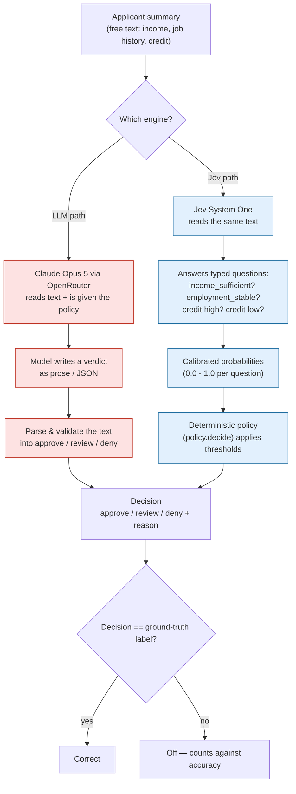
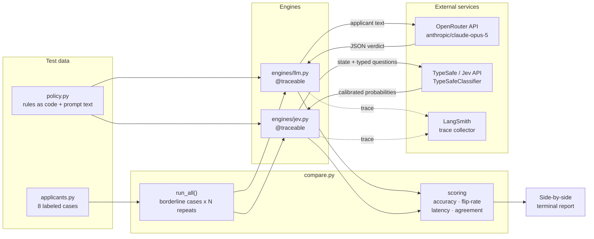

# Jev vs LLM — Loan Eligibility Comparison

A small, honest side-by-side demo of two ways to make the **same structured decision**
from the **same messy natural-language input**:

- **LLM engine** — Claude Opus 5 (via [OpenRouter](https://openrouter.ai)) asked to read an applicant's free-text summary and
  return a verdict (`approve` / `review` / `deny`) with a reason. Flexible, but the output
  is prose you must parse, it's uncalibrated, and it drifts on borderline cases.
- **Jev engine** — [Jev](https://www.langchain.com/blog/building-a-harness-with-jev) (TypeSafe AI's
  "System One" classifier) answers a few **typed questions** (`noul` / `score`) about the same
  text and returns **calibrated probabilities**. A tiny, auditable Python policy turns those
  into the final decision. Reportedly ~200x faster and ~400x cheaper than an LLM on classification.

Both engines are traced in **LangSmith** so you can inspect every call.

## The point

| | Claude Opus 5 (OpenRouter) | Jev System One |
|---|---|---|
| Output | prose to parse | typed values + probabilities |
| Directly usable by software | needs coercion | yes |
| Calibrated confidence | no | yes (per question) |
| Determinism on borderline cases | flips | stable |
| Latency / cost | high | ~200x / ~400x better |

The comparison is deliberately a **fair fight**: the LLM is given the *exact same policy*
in its prompt. The story isn't "the LLM doesn't know the rules" — it's "even told the rules,
the free-text engine is slower, uncalibrated, and less stable than typed structured decisions."

## Architecture

Two views of the same system: the **decision workflow** (what happens to an applicant,
in business terms) and the **technical workflow** (how the code, APIs, and tracing fit
together).

### 1. User decision workflow

How a single loan applicant flows from a messy natural-language summary to a final
`approve` / `review` / `deny` decision — down both engines in parallel, judged against
the same policy.



**Reading the two paths:**

| Step | LLM path | Jev path |
|---|---|---|
| Understand text | Model reads it | Model reads it |
| Produce decision | Model *judges* and writes prose | Model *answers typed questions*; **Python** judges |
| Where the rules live | Inside the prompt (hope the model follows) | In `policy.decide()` — explicit, auditable code |
| Confidence | None exposed | Calibrated probability per factor |
| Repeatability | Can flip run-to-run on borderline cases | Stable: same probabilities → same decision |

The key architectural move: **Jev separates perception from judgment.** The model only
classifies; the deterministic policy decides. The LLM path fuses both into one opaque step.

### 2. Technical workflow

How the code, external APIs, and observability wire together across one `compare.py` run.



**Component responsibilities:**

- **`policy.py`** — the contract. `decide(Factors)` is the executable rulebook; `POLICY_TEXT`
  is the *same* rulebook rendered for the LLM prompt. Both engines are judged against it, so
  neither gets an information advantage.
- **`applicants.py`** — 8 hand-labeled cases. Ground-truth labels are computed from
  `policy.decide`, so they can never contradict the rules. Borderline cases carry a flag that
  tells the harness to repeat them.
- **`engines/llm.py`** — builds a system prompt from `POLICY_TEXT`, calls Claude Opus 5 through
  OpenRouter's OpenAI-compatible API at
  `temperature=0`, forces `response_format=json_object`, then **parses and validates** the
  prose into a decision (the "coercion tax"). Wrapped in `@traceable` → LangSmith.
- **`engines/jev.py`** — sends the applicant text as Jev's `state` plus four typed `noul`
  questions, reads back calibrated probabilities, thresholds them into `Factors`, and calls
  `policy.decide`. Wrapped in `@traceable` → LangSmith.
- **`compare.py`** — orchestrates: runs each applicant down both engines (borderline cases
  `N=5` times), catches per-call errors so one bad key doesn't abort the run, and scores
  **accuracy, flip-rate, mean latency, and cross-engine agreement**.
- **LangSmith** — receives a trace from every engine call (both paths), so each Opus and
  Jev invocation is inspectable after the run.

**Data contracts between the pieces:**

| Boundary | Sent | Returned |
|---|---|---|
| harness → engine | `applicant.text` (str) | `EngineResult(decision, reason, latency_ms, detail)` |
| engines/llm → OpenRouter | system(policy) + user(text) | JSON `{decision, reason}` |
| engines/jev → Jev | `state` + typed `noul` questions | probability per question (0.0–1.0) |
| engine → LangSmith | run inputs/outputs/timing | trace id (async, non-blocking) |

## Layout

```
src/jev_compare/
  policy.py        # the eligibility rules (shared ground truth + Jev decision policy)
  applicants.py    # hand-labeled test cases (clear approve/deny + borderline)
  config.py        # .env loading + shared EngineResult type
  engines/
    llm.py         # Claude Opus 5 via OpenRouter, LangSmith-traced
    jev.py         # Jev typed questions + policy, LangSmith-traced
  compare.py       # runs engines, repeats borderline cases, scores accuracy/determinism/latency
  __main__.py      # `python -m jev_compare`
tests/             # offline tests (policy rules, LLM output parsing)
```

## Run

```bash
python3 -m venv .venv && source .venv/bin/activate
pip install -r requirements.txt        # installs the package in editable mode + pytest
cp .env.example .env                   # then fill in OPENROUTER_API_KEY (and TYPESAFE_API_KEY)

pytest                                  # offline tests, no keys needed
jev-compare                             # both engines (same as: python -m jev_compare)
jev-compare --engines LLM --repeats 3   # only Claude Opus 5 via OpenRouter
```

Set `OPENROUTER_MODEL` to compare any other OpenRouter model (e.g. `openai/gpt-4o-mini`).

**Jev is not on OpenRouter.** It is served by TypeSafe AI and needs their
`langchain-typesafe` SDK (not on PyPI) plus `TYPESAFE_API_KEY`. Without them, the Jev column
reports errors and `--engines LLM` runs the LLM side alone.
